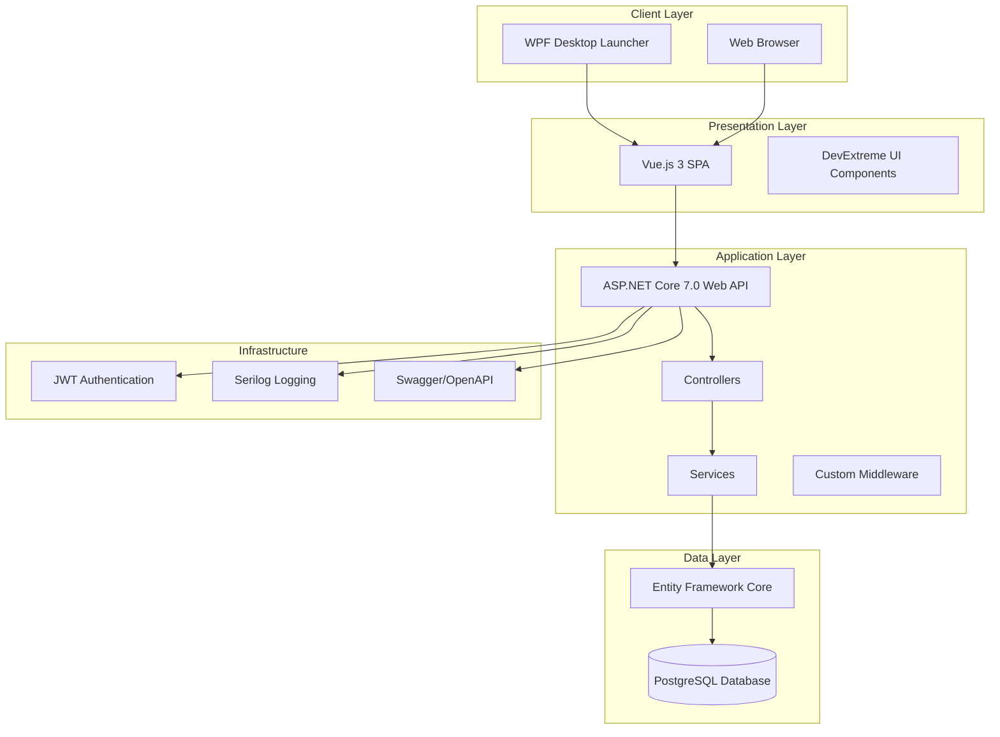
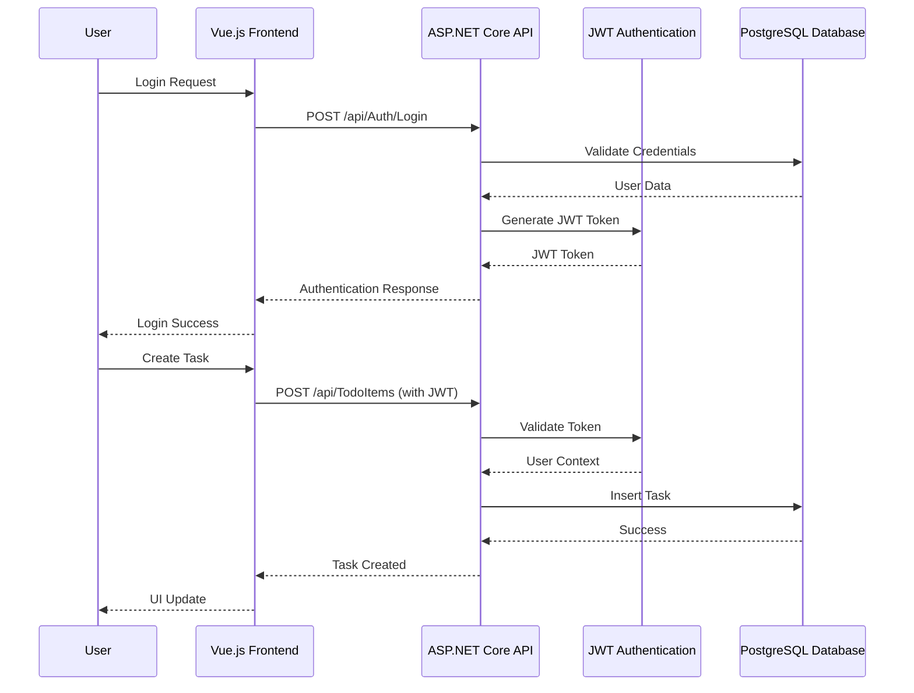
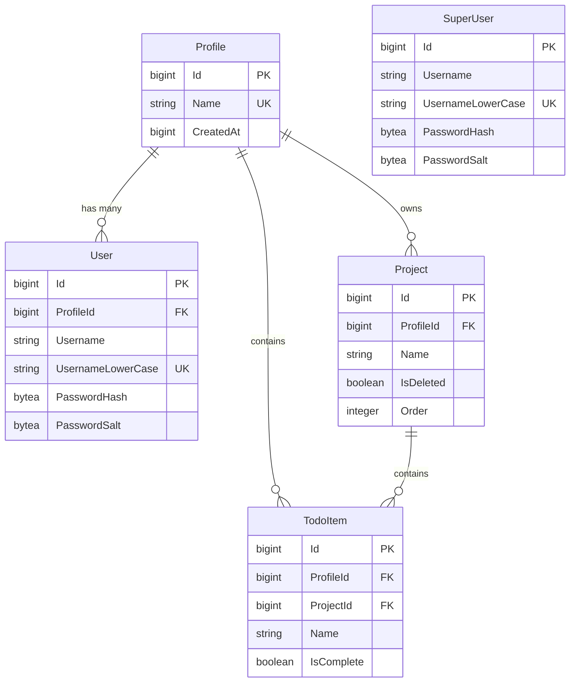

# TodoLists Application - Technical Specification

## Table of Contents
1. [Executive Summary](#executive-summary)
2. [System Architecture](#system-architecture)
3. [Database Design](#database-design)
4. [API Specification](#api-specification)
5. [Frontend Architecture](#frontend-architecture)
6. [Security Architecture](#security-architecture)
7. [Deployment Architecture](#deployment-architecture)
8. [Testing Strategy](#testing-strategy)
9. [Technical Requirements](#technical-requirements)
10. [Development Guidelines](#development-guidelines)

---

## 1. Executive Summary

### 1.1 Project Overview
The TodoLists application is a comprehensive multi-tenant task management system designed to provide secure, isolated workspaces for different user profiles. The system enables users to organize tasks into projects with complete data separation between tenants.

### 1.2 Key Features
- **Multi-tenant Architecture**: Complete data isolation between user profiles
- **Project-based Organization**: Tasks grouped into manageable projects
- **Real-time Task Management**: Inline editing and instant updates
- **Cross-platform Access**: Web-based interface with desktop launcher
- **Administrative Controls**: Super user management capabilities
- **Secure Authentication**: JWT-based authentication with role-based authorization

### 1.3 Technology Stack
- **Backend**: ASP.NET Core 7.0 Web API
- **Frontend**: Vue.js 3 with DevExtreme UI components
- **Database**: PostgreSQL with Entity Framework Core
- **Desktop**: WPF launcher application
- **Authentication**: JWT Bearer tokens
- **Testing**: NUnit with Selenium WebDriver
- **Logging**: Serilog with file and console outputs

---

## 2. System Architecture

### 2.1 High-Level Architecture



### 2.2 Component Architecture

#### 2.2.1 Backend Components
- **Controllers**: Handle HTTP requests and responses
  - [`AuthController`](App/Controllers/AuthController.cs): Authentication endpoints
  - [`ProjectsController`](App/Controllers/ProjectsController.cs): Project management
  - [`TodoItemsController`](App/Controllers/TodoItemsController.cs): Task operations
  - [`UsersController`](App/Controllers/UsersController.cs): User management
  - [`ProfilesController`](App/Controllers/ProfilesController.cs): Profile administration
  - [`SuperUsersController`](App/Controllers/SuperUsersController.cs): Super user operations

- **Services**: Business logic and cross-cutting concerns
  - [`UserService`](App/Services/UserService.cs): Current user context management
  - Authentication and authorization services
  - Data validation and transformation

- **Entities**: Data models and database context
  - [`TodoListsDbContext`](App/Entities/TodoListsDbContext.cs): EF Core database context
  - Entity models with relationships and constraints

#### 2.2.2 Frontend Components
- **Vue.js Application**: Single-page application structure
  - [`App.vue`](App/vue/src/App.vue): Root application component
  - [`MainPanel.vue`](App/vue/src/components/MainPanel.vue): Main task management interface
  - [`LoginButton.vue`](App/vue/src/components/LoginButton.vue): Authentication component
  - [`ProjectsPanel.vue`](App/vue/src/components/MainPage/ProjectsPanel.vue): Project management panel

### 2.3 Data Flow Architecture



---

## 3. Database Design

### 3.1 Entity Relationship Diagram



### 3.2 Database Schema Details

#### 3.2.1 Core Entities

**Profile Entity** ([`Profile.cs`](App/Entities/Profile.cs))
- Primary tenant isolation mechanism
- Unique profile names across the system
- Timestamp tracking for audit purposes

**User Entity** ([`User.cs`](App/Entities/User.cs))
- Profile-scoped user accounts
- Case-insensitive username handling
- HMACSHA512 password hashing with salt

**SuperUser Entity** ([`SuperUser.cs`](App/Entities/SuperUser.cs))
- Global administrative accounts
- Independent of profile isolation
- Same security model as regular users

**Project Entity** ([`Project.cs`](App/Entities/Project.cs))
- Task organization containers
- Soft delete functionality
- Profile-scoped isolation
- Custom ordering support for drag-and-drop reordering

**TodoItem Entity** ([`TodoItem.cs`](App/Entities/TodoItem.cs))
- Individual task records
- Completion status tracking
- Dual foreign key relationship (Profile + Project)

#### 3.2.2 Database Configuration
- **Naming Convention**: Snake_case column naming via EFCore.NamingConventions
- **Primary Keys**: Auto-incrementing bigint (PostgreSQL serial)
- **Indexes**: Unique constraints on critical lookup fields
- **Relationships**: Explicit foreign key relationships with navigation properties

### 3.3 Data Isolation Strategy
- **Profile-based Tenancy**: All user data scoped to ProfileId
- **Query Filtering**: Automatic profile filtering in all data access
- **Security Enforcement**: Profile ID extracted from JWT claims
- **Data Integrity**: Foreign key constraints ensure referential integrity

---

## 4. API Specification

### 4.1 Authentication Endpoints

#### POST /api/Auth/Login
**Purpose**: Authenticate regular users
**Request Body**:
```json
{
  "profile": "string",
  "username": "string", 
  "password": "string"
}
```
**Response**: JWT token string
**Security**: Public endpoint

#### POST /api/Auth/LoginSuperUser
**Purpose**: Authenticate super users
**Request Body**:
```json
{
  "username": "string",
  "password": "string"
}
```
**Response**: JWT token string
**Security**: Public endpoint

### 4.2 Project Management Endpoints

#### GET /api/Projects
**Purpose**: Retrieve user's projects
**Query Parameters**: 
- `projectName` (optional): Filter by project name
**Response**: Array of ProjectDto objects
**Security**: Requires authentication

#### POST /api/Projects
**Purpose**: Create new project
**Request Body**: ProjectDto object
**Response**: Created project ID
**Security**: Requires authentication

#### POST /api/Projects/Clone
**Purpose**: Clone existing project with all tasks
**Request Body**:
```json
{
  "id": "number"
}
```
**Response**: Updated projects list
**Security**: Requires authentication

#### POST /api/Projects/Reorder
**Purpose**: Reorder projects via drag-and-drop
**Request Body**:
```json
{
  "projectIds": ["number array in new order"]
}
```
**Response**: Updated projects list
**Security**: Requires authentication

#### PATCH /api/Projects
**Purpose**: Bulk update projects (DevExtreme format)
**Request Body**: Array of change operations
**Response**: Success confirmation
**Security**: Requires authentication

### 4.3 Task Management Endpoints

#### GET /api/TodoItems
**Purpose**: Retrieve tasks for a project
**Query Parameters**:
- `projectId`: Required project identifier
**Response**: Array of TodoItem objects
**Security**: Requires authentication

#### POST /api/TodoItems
**Purpose**: Create new task
**Request Body**: TodoItem object
**Response**: Created task details
**Security**: Requires authentication

#### PATCH /api/TodoItems
**Purpose**: Bulk update tasks (DevExtreme format)
**Request Body**: Array of change operations
**Response**: Success confirmation
**Security**: Requires authentication

### 4.4 Administrative Endpoints

#### GET /api/Users
**Purpose**: List users in profile
**Security**: Requires super user role

#### POST /api/Users
**Purpose**: Create new user
**Security**: Requires super user role

#### GET /api/Profiles
**Purpose**: List all profiles
**Security**: Requires super user role

#### POST /api/Profiles
**Purpose**: Create new profile
**Security**: Requires super user role

### 4.5 API Response Formats

**Success Response**:
```json
{
  "data": "object or array",
  "status": "success"
}
```

**Error Response**:
```json
{
  "error": "error message",
  "status": "error",
  "details": "additional error information"
}
```

---

## 5. Frontend Architecture

### 5.1 Vue.js Application Structure

#### 5.1.1 Component Hierarchy
```
App.vue (Root)
├── UserPanel.vue (Top toolbar)
├── LoginButton.vue (Authentication)
├── NoAccessPanel.vue (Unauthorized state)
└── MainPanel.vue (Main interface)
    └── ProjectsPanel.vue (Project management)
```

#### 5.1.2 Key Components

**App Component** ([`App.vue`](App/vue/src/App.vue))
- Root application component
- Conditional rendering based on authentication state
- User context management

**MainPanel Component** ([`MainPanel.vue`](App/vue/src/components/MainPanel.vue))
- Split-pane layout using Splitpanes library
- Real-time task management with DevExtreme DataGrid
- Project-task relationship handling
- Inline editing capabilities

**LoginButton Component** ([`LoginButton.vue`](App/vue/src/components/LoginButton.vue))
- DevExtreme Form-based authentication
- Profile and user credential input
- JWT token storage and management
- Popover-based UI presentation

**ProjectsPanel Component** ([`ProjectsPanel.vue`](App/vue/src/components/MainPage/ProjectsPanel.vue))
- DevExtreme DataGrid for project management
- Drag-and-drop reordering with immediate UI feedback
- Inline editing and deletion
- Project cloning functionality
- Custom order persistence and synchronization

### 5.2 State Management

#### 5.2.1 Authentication State
- JWT token stored in localStorage
- Token parsing for user information extraction
- Automatic token validation and cleanup
- Page reload on authentication state changes

#### 5.2.2 Data Flow
- RESTful API communication via fetch utilities
- Real-time UI updates after data operations
- DevExtreme DataGrid integration for bulk operations
- Error handling with user notifications

### 5.3 UI Framework Integration

#### 5.3.1 DevExtreme Components
- **DataGrid**: Primary data display and editing
- **Form**: Structured input handling
- **Button**: Action triggers
- **Popover**: Modal-like interactions
- **Notify**: User feedback system

#### 5.3.2 Layout Management
- **Splitpanes**: Resizable panel layout
- **Responsive Design**: Automatic sizing adjustments
- **CSS Grid/Flexbox**: Modern layout techniques

### 5.4 Build and Development

#### 5.4.1 Vue CLI Configuration
- **Development Server**: Hot reload capability
- **Build Process**: Production optimization
- **Linting**: ESLint with Vue.js rules
- **Browser Support**: Modern browser compatibility

#### 5.4.2 Asset Management
- **Static Assets**: Public directory serving
- **Component Styles**: Scoped CSS support
- **External Libraries**: DevExtreme and jQuery integration

### 5.5 Drag-and-Drop Functionality

#### 5.5.1 Project Reordering
- **DevExtreme RowDragging**: Built-in drag-and-drop support
- **Real-time Updates**: Immediate UI feedback during reordering
- **Backend Synchronization**: Automatic order persistence to database
- **Error Handling**: Graceful fallback with data refresh on failures

#### 5.5.2 Implementation Details
- **Event Handling**: `@reorder` event captures drag-and-drop operations
- **Order Calculation**: Client-side array manipulation for new sequence
- **API Integration**: RESTful endpoint for order updates
- **State Management**: Local array updates for immediate UI response
- **Data Consistency**: Server-side validation and persistence

---

## 6. Security Architecture

### 6.1 Authentication System

#### 6.1.1 JWT Implementation
- **Algorithm**: HMACSHA512 signature
- **Claims Structure**:
  - `ClaimTypes.Name`: Username
  - `ClaimTypes.Role`: User role (superuser)
  - `UserService.ProfileIdClaimType`: Profile identifier
- **Token Expiration**: 12-hour validity period
- **Key Management**: Configurable JWT signing key

#### 6.1.2 Password Security
- **Hashing Algorithm**: HMACSHA512
- **Salt Generation**: Cryptographically secure random salts
- **Storage**: Separate hash and salt columns
- **Verification**: Constant-time comparison

### 6.2 Authorization Framework

#### 6.2.1 Role-Based Access Control
- **Public Endpoints**: Authentication endpoints
- **Authenticated Endpoints**: Require valid JWT token
- **Super User Endpoints**: Administrative functions only

#### 6.2.2 Multi-Tenant Security
- **Profile Isolation**: Automatic filtering by ProfileId
- **Data Access Control**: Profile ID from JWT claims
- **Query Filtering**: Enforced at service layer
- **Cross-Tenant Prevention**: No data leakage between profiles

### 6.3 Input Validation and Sanitization

#### 6.3.1 Server-Side Validation
- **Model Validation**: Data annotation attributes
- **Business Rule Validation**: Custom validation logic
- **SQL Injection Prevention**: Parameterized queries via EF Core
- **XSS Protection**: Input encoding and validation

#### 6.3.2 Client-Side Validation
- **Form Validation**: DevExtreme validation rules
- **Input Sanitization**: Client-side data cleaning
- **CSRF Protection**: SameSite cookie attributes

### 6.4 Security Headers and Configuration

#### 6.4.1 HTTP Security Headers
- **HTTPS Enforcement**: Redirect to secure connections
- **Content Security Policy**: XSS attack prevention
- **HSTS**: HTTP Strict Transport Security
- **X-Frame-Options**: Clickjacking protection

#### 6.4.2 CORS Configuration
- **Origin Restrictions**: Controlled cross-origin access
- **Method Limitations**: Specific HTTP methods allowed
- **Credential Handling**: Secure cookie transmission

---

## 7. Deployment Architecture

### 7.1 Application Deployment

#### 7.1.1 Backend Deployment
- **Runtime**: .NET 7.0 runtime environment
- **Web Server**: Kestrel with reverse proxy (IIS/Nginx)
- **Configuration**: Environment-specific appsettings
- **Database**: PostgreSQL server connection
- **Logging**: File-based logging with rotation

#### 7.1.2 Frontend Deployment
- **Build Process**: Vue CLI production build
- **Static Files**: Served via ASP.NET Core static file middleware
- **Asset Optimization**: Minification and bundling
- **CDN Integration**: DevExtreme library serving

#### 7.1.3 Desktop Launcher
- **WPF Application**: Windows-specific deployment
- **PostgreSQL Management**: Local database lifecycle
- **Web App Integration**: Browser automation
- **Process Management**: Service startup and monitoring

### 7.2 Database Deployment

#### 7.2.1 PostgreSQL Configuration
- **Version**: PostgreSQL 12+ recommended
- **Connection Pooling**: Npgsql connection management
- **Schema Management**: Entity Framework migrations
- **Backup Strategy**: Regular database backups
- **Performance Tuning**: Index optimization

#### 7.2.2 Migration Strategy
- **Code-First Approach**: EF Core migrations
- **Version Control**: Migration scripts in source control
- **Deployment Automation**: Automated migration execution
- **Rollback Procedures**: Migration reversal capabilities

### 7.3 Environment Configuration

#### 7.3.1 Development Environment
- **Local Database**: PostgreSQL development instance
- **Hot Reload**: Vue.js development server
- **Debug Configuration**: Detailed logging and debugging
- **Test Data**: Seed data for development

#### 7.3.2 Production Environment
- **Load Balancing**: Multiple application instances
- **Database Clustering**: High availability PostgreSQL
- **Monitoring**: Application performance monitoring
- **Security Hardening**: Production security configuration

### 7.4 DevOps and CI/CD

#### 7.4.1 Build Pipeline
- **Source Control**: Git-based version control
- **Automated Testing**: Unit and integration tests
- **Build Automation**: Continuous integration
- **Artifact Management**: Build artifact storage

#### 7.4.2 Deployment Pipeline
- **Environment Promotion**: Dev → Test → Production
- **Blue-Green Deployment**: Zero-downtime deployments
- **Rollback Capabilities**: Quick rollback procedures
- **Health Checks**: Post-deployment verification

---

## 8. Testing Strategy

### 8.1 Testing Framework

#### 8.1.1 Integration Testing
- **Framework**: NUnit testing framework
- **Web Automation**: Selenium WebDriver
- **Test Structure**: Page Object Model pattern
- **Browser Support**: Chrome, Firefox, Edge

#### 8.1.2 Test Organization
- **Test Projects**: [`Tests.Integration`](IntegrationTests/Tests.Integration/Tests.Integration.csproj)
- **Page Objects**: Reusable UI interaction components
- **Test Utilities**: Common testing functionality
- **Test Data**: Controlled test data management

### 8.2 Test Categories

#### 8.2.1 Unit Tests
- **Controller Testing**: API endpoint validation
- **Service Testing**: Business logic verification
- **Entity Testing**: Data model validation
- **Utility Testing**: Helper function verification

#### 8.2.2 Integration Tests
- **End-to-End Workflows**: Complete user scenarios
- **API Integration**: Full request-response cycles
- **Database Integration**: Data persistence verification
- **Authentication Testing**: Security flow validation

#### 8.2.3 UI Tests
- **Component Testing**: Vue.js component functionality
- **User Interaction**: Form submission and navigation
- **Responsive Design**: Cross-device compatibility
- **Accessibility Testing**: WCAG compliance verification

### 8.3 Test Data Management

#### 8.3.1 Test Database
- **Isolated Environment**: Separate test database
- **Data Seeding**: Controlled test data creation
- **Cleanup Procedures**: Test data removal
- **State Management**: Test isolation and repeatability

#### 8.3.2 Mock Services
- **External Dependencies**: Service mocking
- **API Simulation**: Controlled response scenarios
- **Error Simulation**: Failure condition testing
- **Performance Testing**: Load and stress testing

### 8.4 Continuous Testing

#### 8.4.1 Automated Test Execution
- **CI/CD Integration**: Automated test runs
- **Test Reporting**: Detailed test result analysis
- **Coverage Analysis**: Code coverage metrics
- **Quality Gates**: Test-based deployment gates

#### 8.4.2 Test Maintenance
- **Test Refactoring**: Test code quality maintenance
- **Test Data Updates**: Evolving test scenarios
- **Framework Updates**: Testing tool upgrades
- **Performance Optimization**: Test execution efficiency

---

## 9. Technical Requirements

### 9.1 System Requirements

#### 9.1.1 Server Requirements
- **Operating System**: Windows Server 2019+ or Linux (Ubuntu 20.04+)
- **Runtime**: .NET 7.0 Runtime
- **Memory**: Minimum 4GB RAM, Recommended 8GB+
- **Storage**: 50GB+ available disk space
- **Network**: Stable internet connection for external dependencies

#### 9.1.2 Database Requirements
- **PostgreSQL**: Version 12.0 or higher
- **Memory**: Minimum 2GB dedicated RAM
- **Storage**: SSD recommended for performance
- **Backup**: Regular backup storage capacity
- **Network**: Low-latency connection to application server

#### 9.1.3 Client Requirements
- **Web Browser**: Chrome 90+, Firefox 88+, Edge 90+, Safari 14+
- **JavaScript**: ES6+ support required
- **Screen Resolution**: Minimum 1024x768
- **Network**: Broadband internet connection
- **Desktop Launcher**: Windows 10+ for WPF application

### 9.2 Performance Requirements

#### 9.2.1 Response Time Targets
- **API Endpoints**: < 200ms average response time
- **Page Load**: < 3 seconds initial load
- **UI Interactions**: < 100ms response time
- **Database Queries**: < 50ms average execution time

#### 9.2.2 Scalability Requirements
- **Concurrent Users**: Support 100+ simultaneous users
- **Data Volume**: Handle 1M+ todo items per profile
- **Transaction Rate**: 1000+ API calls per minute
- **Storage Growth**: Accommodate 10GB+ data growth annually

#### 9.2.3 Availability Requirements
- **Uptime**: 99.5% availability target
- **Recovery Time**: < 4 hours maximum downtime
- **Backup Frequency**: Daily automated backups
- **Disaster Recovery**: 24-hour recovery point objective

### 9.3 Security Requirements

#### 9.3.1 Authentication Requirements
- **Password Policy**: Minimum 8 characters, complexity rules
- **Session Management**: 12-hour token expiration
- **Account Lockout**: Protection against brute force attacks
- **Multi-Factor Authentication**: Future enhancement capability

#### 9.3.2 Data Protection Requirements
- **Encryption**: HTTPS/TLS 1.3 for data in transit
- **Data Storage**: Encrypted password storage
- **Access Control**: Role-based authorization
- **Audit Logging**: Security event tracking

#### 9.3.3 Compliance Requirements
- **Data Privacy**: GDPR compliance considerations
- **Data Retention**: Configurable data retention policies
- **Access Logs**: Comprehensive audit trail
- **Security Updates**: Regular security patch management

### 9.4 Integration Requirements

#### 9.4.1 External Dependencies
- **DevExtreme**: UI component library
- **PostgreSQL**: Database system
- **Serilog**: Logging framework
- **Entity Framework**: ORM framework

#### 9.4.2 API Compatibility
- **REST Standards**: RESTful API design
- **JSON Format**: Standard JSON request/response
- **HTTP Status Codes**: Proper status code usage
- **Versioning**: API version management strategy

---

## 10. Development Guidelines

### 10.1 Coding Standards

#### 10.1.1 C# Backend Standards
- **Naming Conventions**: PascalCase for public members, camelCase for private
- **Code Organization**: Logical namespace and folder structure
- **Documentation**: XML documentation for public APIs
- **Error Handling**: Consistent exception handling patterns
- **Async/Await**: Proper asynchronous programming patterns

#### 10.1.2 JavaScript/Vue.js Standards
- **ES6+ Features**: Modern JavaScript syntax
- **Component Structure**: Single File Components (SFC)
- **Naming Conventions**: kebab-case for component names
- **State Management**: Reactive data patterns
- **Error Handling**: User-friendly error messages

#### 10.1.3 Database Standards
- **Naming Convention**: snake_case for database objects
- **Indexing Strategy**: Performance-optimized indexes
- **Constraint Usage**: Proper foreign key relationships
- **Migration Management**: Incremental schema changes

### 10.2 Architecture Patterns

#### 10.2.1 Backend Patterns
- **Repository Pattern**: Data access abstraction
- **Dependency Injection**: Loose coupling via DI container
- **Middleware Pattern**: Cross-cutting concerns
- **DTO Pattern**: Data transfer object usage
- **Service Layer**: Business logic encapsulation

#### 10.2.2 Frontend Patterns
- **Component Composition**: Reusable component design
- **Props/Events**: Parent-child communication
- **Computed Properties**: Reactive data derivation
- **Lifecycle Hooks**: Component lifecycle management
- **Utility Functions**: Shared functionality modules

### 10.3 Version Control Guidelines

#### 10.3.1 Git Workflow
- **Branch Strategy**: Feature branches with main/develop
- **Commit Messages**: Descriptive commit messages
- **Pull Requests**: Code review process
- **Merge Strategy**: Squash and merge for features
- **Tag Management**: Version tagging for releases

#### 10.3.2 Code Review Process
- **Review Criteria**: Code quality, security, performance
- **Documentation**: Adequate code documentation
- **Testing**: Test coverage requirements
- **Standards Compliance**: Coding standard adherence

### 10.4 Documentation Standards

#### 10.4.1 Code Documentation
- **Inline Comments**: Complex logic explanation
- **API Documentation**: Swagger/OpenAPI specifications
- **README Files**: Project setup and usage instructions
- **Architecture Documentation**: System design documentation

#### 10.4.2 User Documentation
- **User Guides**: End-user documentation
- **Installation Guides**: Deployment instructions
- **Troubleshooting**: Common issue resolution
- **FAQ**: Frequently asked questions

### 10.5 Quality Assurance

#### 10.5.1 Code Quality Metrics
- **Test Coverage**: Minimum 80% code coverage
- **Code Complexity**: Cyclomatic complexity limits
- **Code Duplication**: DRY principle adherence
- **Performance Metrics**: Response time monitoring

#### 10.5.2 Continuous Improvement
- **Code Refactoring**: Regular code improvement
- **Performance Optimization**: Ongoing performance tuning
- **Security Updates**: Regular security assessments
- **Technology Updates**: Framework and library updates

---

## Conclusion

This technical specification provides a comprehensive overview of the TodoLists application architecture, design decisions, and implementation guidelines. The document serves as a reference for development teams, system administrators, and stakeholders involved in the project lifecycle.

The multi-tenant architecture ensures secure data isolation while providing a scalable foundation for future enhancements. The modern technology stack leverages industry best practices for web application development, security, and deployment.

Regular updates to this specification should reflect system evolution, new requirements, and architectural improvements as the application continues to mature.
